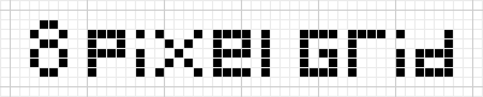

# 

> The 8 point scss grid system.

### Installation
```bash
npm install 8-point-grid --save
```

### Usage
Customize [variables](scss/_variables.scss) to your liking.
- `$prefix` whatever prefix you want, leave this empty if you want -classname
- `$size` number of pixels you want your grid to be, ofc we use 8 :ok_hand:
- `$amount` iterations of the size `$size * $amount`
- `$line` line-height multiplier `line-height: $size * $amount * $line`

Include scss in your build or use the [compiled](dist/8-point-grid.css) css file with the default settings.

### Sketch
This repo also contains a Sketch file with an 8 point grid. [Download Sketch file](https://github.com/sethne/8-point-grid/raw/master/media/8-point-grid.sketch)

To nudge a element in sketch 8px, go to `Sketch -> Preferences` and set move objects to 8 in the last input.

### What is a 8 point grid?
- https://spec.fm/specifics/8-pt-grid
- https://blog.prototypr.io/the-8pt-grid-consistent-spacing-in-ui-design-with-sketch-577e4f0fd520
- https://builttoadapt.io/intro-to-the-8-point-grid-system-d2573cde8632
- https://medium.com/sketch-app-sources/8-point-soft-grids-in-sketch-e8f1d5ca2cd4
- https://material.io/guidelines/layout/metrics-keylines.html#metrics-keylines-baseline-grids
- http://harmony.intuit.com/grid/